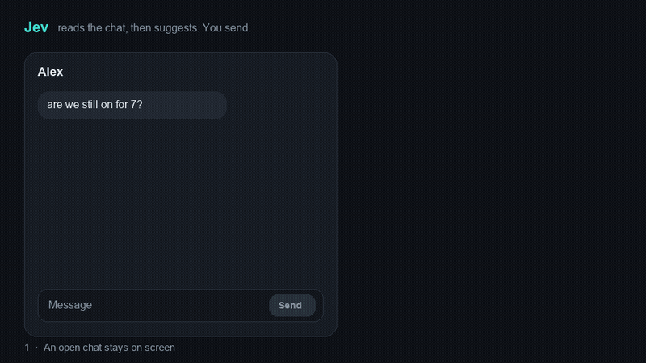
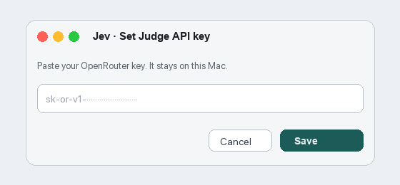
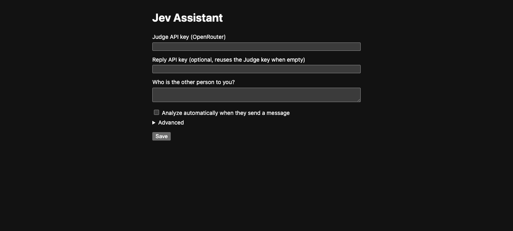
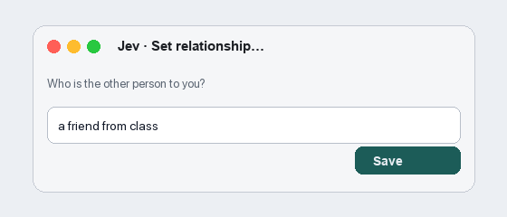
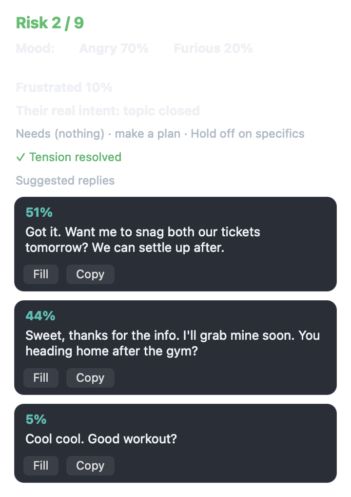
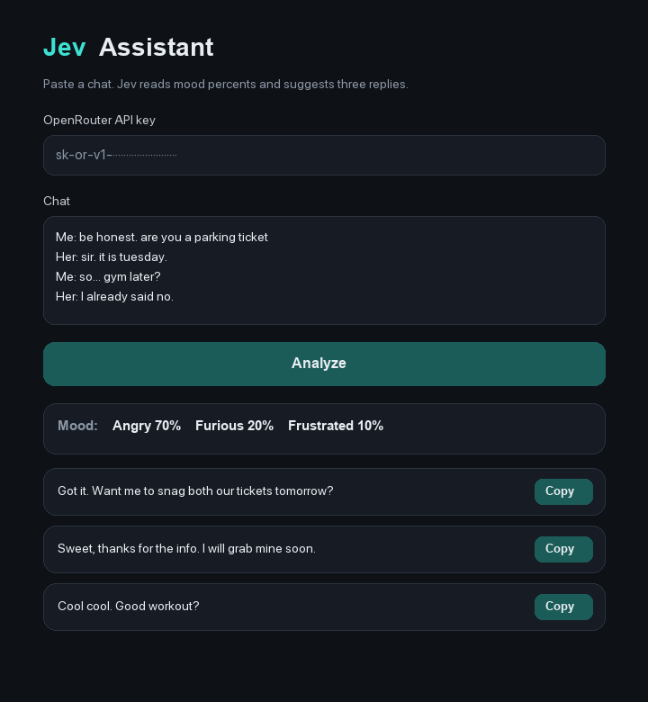
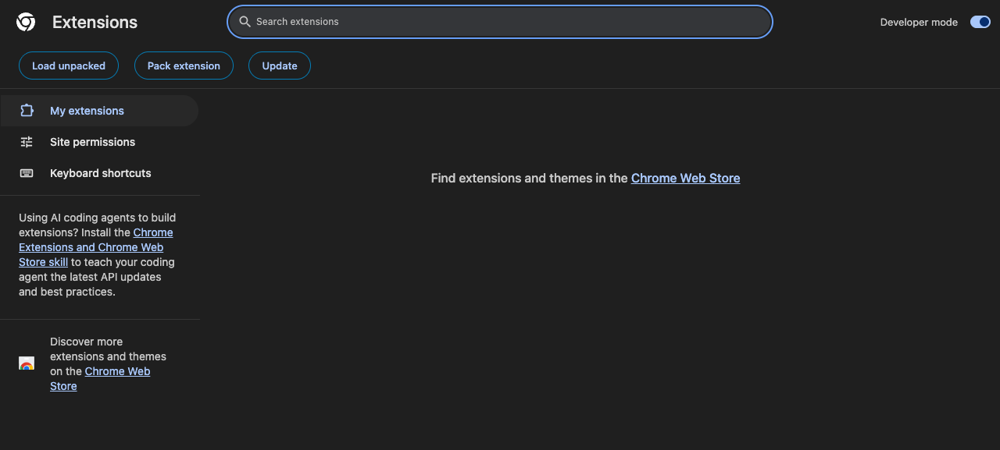
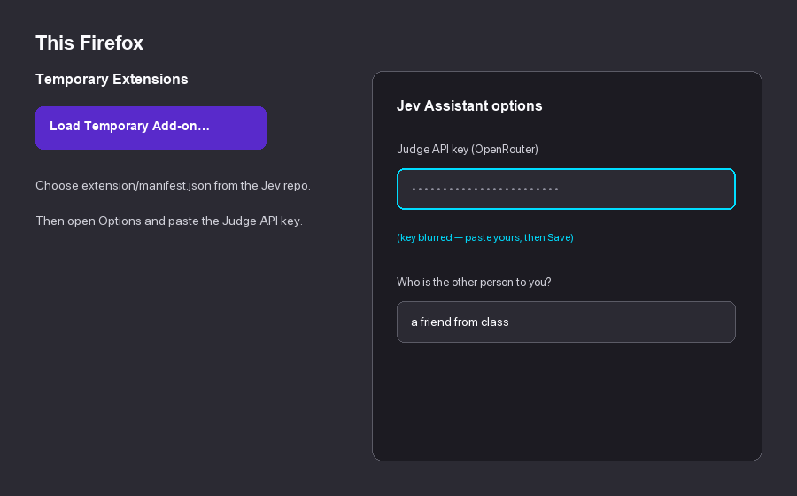
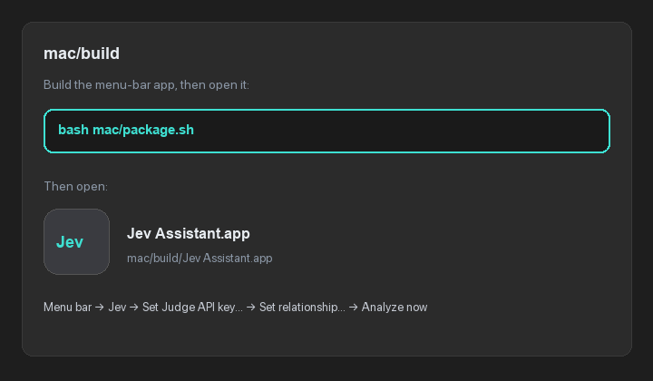

<div align="center">


# Jev Assistant

**Jev reads the open chat, judges what the other person wants, and suggests three replies. You choose one. Jev fills the box. You press send.**

</div>

## Demo

About fifteen seconds, two analyzes. He tries a parking-ticket line. She is not impressed. Jev ranks safer replies. He course-corrects; she softens; Jev analyzes again with a warmer mood and a real plan. Send stays his.



[Play the video](docs/demo.mp4)

## Contents

- [What Jev does](#what-jev-does)
- [Connect an OpenRouter API key](#connect-an-openrouter-api-key)
- [Phone](#phone)
- [Windows](#windows)
- [Android](#android)
- [Mac](#mac)
- [Windows or Linux](#windows-or-linux)
- [Supported chats](#supported-chats)
- [How a suggestion is made](#how-a-suggestion-is-made)
- [FAQ](#faq)
- [Limitations](#limitations)
- [License](#license)

## What Jev does

- **It judges before it writes.** A judgment model names the other person's intent, the risk, and whether to reply now. A second model drafts three replies. The judgment model ranks them.
- **It only reads the screen.** No hooking, no repackaging, no private APIs, no reading the chat app's database. Android uses the accessibility service. On a Mac, the menu-bar app reads Messages and WhatsApp Desktop through Accessibility, and reads a front Chrome or Firefox chat through Screen Recording. A Mac does not use the browser extension. That extension is only for Windows and Linux.
- **Sending stays yours.** Fill writes the chosen reply into the compose box, or copies it if the box cannot be written. Jev never presses Send.
- **Your key, your quota.** Judge, reply, and vision can each use a different endpoint. One OpenRouter key is enough: leave the reply and vision keys blank and they reuse the judge key.
- **Notes stay on the device.** A local knowledge base and contact notes can be included in an analysis. Chat text is sent only to the endpoint you configured, at the moment you analyze.

## Connect an OpenRouter API key

Jev does not ship a key. Analysis calls [OpenRouter](https://openrouter.ai/) with yours. OpenRouter bills the models against your credit.

**1. Create the key.** Sign in at [openrouter.ai](https://openrouter.ai/), open [openrouter.ai/keys](https://openrouter.ai/keys), and choose **Create Key**. Copy the key. It starts with `sk-or-v1-`. You can set a monthly credit limit on that same page so a run cannot spend without a cap.

**2. Paste it once.**

| Where you use Jev | Where the key goes |
|---|---|
| Mac | Menu bar **Jev** → **Set Judge API key…** → Paste → Save. Leave **Set Reply API key** empty to reuse the judge key. No browser extension. |
| Android | Open the app → Settings → Judge API → paste the key. Leave Reply API and Vision API empty. |
| Windows or Linux, Chrome extension | `chrome://extensions` → Jev Assistant → Details → Extension options. Paste the key into **Judge API key** and save. |
| Windows or Linux, Firefox extension | Extensions → Jev Assistant → Options. Paste the key into **Judge API key** and save. Firefox does not share Chrome's saved key. |

<p align="center">
  <br/>
  <em>Mac: Set Judge API key… (fictional key shown)</em>
</p>

<p align="center">
  <br/>
  <em>Chrome / Firefox options: paste into Judge API key</em>
</p>

**3. Say who they are to you.** That short description is what Jev uses as the other person in the chat (`from=me` is you; `from=other` is them).

| Where you use Jev | Where the relationship goes |
|---|---|
| Mac | Menu bar **Jev** → **Set relationship…** |
| Android | Settings → relationship / contact notes for that person. |
| Windows or Linux extension | Extension options → **Who is the other person to you?** |
| Browser paste page | The **Who is the other person to you?** field on [docs/use.html](docs/use.html). |

<p align="center">
  <br/>
  <em>Mac: Jev → Set relationship… (fictional text only)</em>
</p>

**4. Analyze a chat.** Leave a conversation in front (a Direct thread, a WhatsApp chat, or Messages). Open Jev and choose Analyze. The panel shows risk, up to three mood possibilities with percents (spaced so each is easy to scan), and three ranked replies. **Fill** puts the text in the compose box. You send it yourself.

<p align="center">
  <br/>
  <em>Mac panel: three spaced moods + ranked replies (fictional chat)</em>
</p>

<p align="center">
  <br/>
  <em>Browser paste page after Analyze (fictional chat only)</em>
</p>

The default judge and reply models are paid OpenRouter models. To spend less, change the model id in settings to one ending in `:free`. An empty Reply key always reuses the Judge key.

The panel lists up to three **mood** possibilities, highest first, each with a percent — for example `Angry 70%`, `Furious 20%`, `Frustrated 10%` on separate spaced items, not one clutched string. That percent is the model's probability for that mood, judged from the messages with the latest line weighted most.

## Phone

iPhone cannot let an app read WhatsApp, Snapchat, or Messages. Chrome on Android cannot load this extension either. On a phone, open [Jev in the browser](https://zandy700.github.io/Jev-Assistant/use.html), copy the thread out of the chat app, and copy a reply back. Lines look like `Me:` and `Her:`. The OpenRouter key stays in that browser. Jev still does not send. The page source is [docs/use.html](docs/use.html).

## Windows

There is no Windows menu-bar app. Chrome and Edge can still read the open chat without Developer mode and without pasting the thread.

1. Open [Jev in the browser](https://zandy700.github.io/Jev-Assistant/use.html) and save the OpenRouter key.
2. Drag the **Jev** link on that page onto the bookmarks bar.
3. Open the chat on Instagram, WhatsApp Web, Snapchat Web, or Google Messages.
4. Click the **Jev** bookmark.

Jev reads the messages in that tab. Bubbles on the right are you. The inbox beside the chat is not included. A Jev tab opens with the mood percents and three replies. Copy one back. Jev does not send it.

**Read a window** on the same page is the other path. The share picker takes one frame of any chat window, including apps outside those four sites. The picture is not saved.

The [browser extension](#windows-or-linux) can still watch the tab and fill the message box if you want that. A Mac does not need the bookmark or the extension.

## Android

The phone needs Android 11 or newer.

1. On the phone, open [the release APK](apk/jev-assistant-v1.3-release.apk) and download it.
2. Tap the download. If Android blocks it, allow installs from the browser, then open the file.
3. Paste the OpenRouter key in Settings → Judge API.
4. Turn on **Accessibility** and **Display over other apps**.

From a computer you can also run:

```bash
adb install -r apk/jev-assistant-v1.3-release.apk
```

That APK is the older v1.3 build. It does not include mood, or the later WhatsApp and Snapchat readers. Those are in the source tree and need a new build:

```bash
./gradlew assembleDebug
```

The debug APK is written to `app/build/outputs/apk/debug/app-debug.apk`.

## Windows or Linux

On a Mac, skip this section. The menu-bar app reads the chat. You do not install a Chrome or Firefox extension.

This extension is for Windows and Linux. It is the same folder for Chrome and Firefox. It reads WhatsApp Web, Snapchat Web, Instagram Direct, and Google Messages for web.

**Chrome.** Open `chrome://extensions`, turn on Developer mode, choose **Load unpacked**, and select the `extension/` folder. Click the Jev toolbar icon to open the side panel.

<p align="center">
  <br/>
  <em>Chrome: Developer mode → Load unpacked → select <code>extension/</code></em>
</p>

**Firefox.** Open `about:debugging#/runtime/this-firefox`, choose **Load Temporary Add-on…**, and pick `extension/manifest.json`. A temporary add-on is removed when Firefox quits. Load that file again after a restart. Click the Jev toolbar icon to open the sidebar.

<p align="center">
  <br/>
  <em>Firefox: Load Temporary Add-on… → <code>extension/manifest.json</code></em>
</p>

Paste the OpenRouter key in the extension options, as in [Connect an OpenRouter API key](#connect-an-openrouter-api-key). Leave the Reply key blank to reuse it.

An iPhone cannot let an app read WhatsApp or Snapchat. On a computer, use WhatsApp Desktop or WhatsApp Web, or Snapchat Web while signed in. Jev reads that window.

**Fill** only writes into the site's own message box. It does not press Enter and it does not click Send.

## Mac

The menu-bar app is the whole Mac install. Do not load the Chrome or Firefox extension.

It reads Apple Messages (iMessage, and SMS forwarded from an iPhone) and WhatsApp Desktop through Accessibility. For WhatsApp Web, Instagram Direct, Snapchat Web, or Google Messages, leave that browser window in front and choose **Analyze now**. Jev takes one Screen Recording still, reads the bubbles, and runs the same analyze pipeline.

Requirements: macOS 14 or newer, Messages signed in, and SMS forwarding turned on if you want SMS threads.

```bash
bash mac/package.sh
```

Open `mac/build/Jev Assistant.app`. A **Jev** item appears in the menu bar. Grant **Accessibility** (Messages / WhatsApp Desktop) and **Screen Recording** (browser Analyze) under System Settings → Privacy & Security, then set the Judge API key from the Jev menu. Each rebuild changes the ad-hoc signature, so macOS may ask for Accessibility and Screen Recording again.

<p align="center">
  <br/>
  <em>Mac install path: <code>bash mac/package.sh</code> → open <code>mac/build/Jev Assistant.app</code></em>
</p>

Describe your relationship with that person under **Jev → Set relationship…** (see the screenshots in [Connect an OpenRouter API key](#connect-an-openrouter-api-key)). Then bring Messages, WhatsApp Desktop, or a browser chat to the front and choose **Analyze now**.

The menu bar auto-follows Messages and WhatsApp Desktop only. Browser chats are read when you choose **Analyze now** (screen capture).

**Fill** writes the compose field, or copies the text if the field cannot be set. It does not press Return.

## Supported chats

| Chat | Where | How it is read |
|---|---|---|
| WhatsApp | Android app, WhatsApp Desktop, WhatsApp Web | Accessibility on Android and on the Mac app. Screen Recording on Mac for WhatsApp Web. On Windows or Linux, the browser extension reads the page. |
| Snapchat | Android app, Snapchat Web | Accessibility on Android. Screen Recording on Mac. On Windows or Linux, the browser extension reads the page. |
| Instagram | Android app, instagram.com Direct | Accessibility on Android. Screen Recording on Mac. On Windows or Linux, the browser extension reads the page. |
| SMS / iMessage | Google Messages, Apple Messages | Accessibility on Android and on the Mac app for Messages. Screen Recording on Mac for Google Messages on the web. On Windows or Linux, the browser extension reads Google Messages. |
| QQ, X, Feishu | Android | Accessibility. Feishu falls back to on-device OCR when the message text is drawn rather than exposed. |
| Any other app | Android | Overlay menu **Read screen once**. Manual. It does not separate you from the other person. |

Jev only reads chats already open on your own device.

## How a suggestion is made

```
open chat  →  read the recent messages
           →  judge intent, risk, needs, and whether to reply
           →  draft 3 replies
           →  rank those 3
           →  show them
           →  Fill writes the box
           →  you send
```

One adapter per app or site turns the window into a title plus a list of who said what. Everything after that is shared. The judgment call asks only multiple-choice, score, and yes/no questions. The reply model drafts the three candidates.

<details>
<summary><b>Add another Android chat app</b></summary>

1. Implement `ChatAppAdapter` in `app/src/main/java/com/jev/probe/capture/`. `pkg` is the package name. `extract` returns the title and messages, or `null` when the screen is not a chat.
2. Register it in `ChatCaptureService`.
3. Judgment, ranking, the overlay, and Fill stay as they are.

</details>

## FAQ

<details>
<summary><b>Will it send messages for me?</b></summary>

No. Fill only puts the selected reply in the input box. You tap send.

</details>

<details>
<summary><b>Does it need root?</b></summary>

No. It does not modify the chat app and it does not inject into its process.

</details>

<details>
<summary><b>Where does the chat text go?</b></summary>

Only to the API endpoint you saved, and only when you run an analysis. Jev has no server of its own. Local history is off until you turn it on, and then it stays in the app's private storage.

</details>

<details>
<summary><b>Does a Mac need the Chrome extension?</b></summary>

No. Install the menu-bar app, grant Accessibility and Screen Recording, and set the Judge API key from the Jev menu. Chrome and Firefox on a Mac are just the windows Jev reads. The extension is for Windows and Linux.

</details>

<details>
<summary><b>Does the app cost money?</b></summary>

The app is free. OpenRouter charges for the model calls on your key. Set a credit limit when you create the key.

</details>

## Limitations

- The shipped Android APK is v1.3 and does not contain the later WhatsApp and Snapchat readers. Build from source for those.
- Some Android skins freeze the background process. Opening the chat again brings the overlay back.
- Group chats are read as if they were a one-to-one thread.
- Knowledge-base matching is by tag and title text, not by meaning.
- OCR only sees what is on screen. Windows marked secure cannot be captured.
- Firefox add-ons loaded from this folder are temporary and disappear when Firefox quits.

## License

Code is under [MIT](LICENSE). See also [NOTICE](NOTICE).

This project only handles chats on your own device that you already have the right to view. Follow each app's terms and local law.
